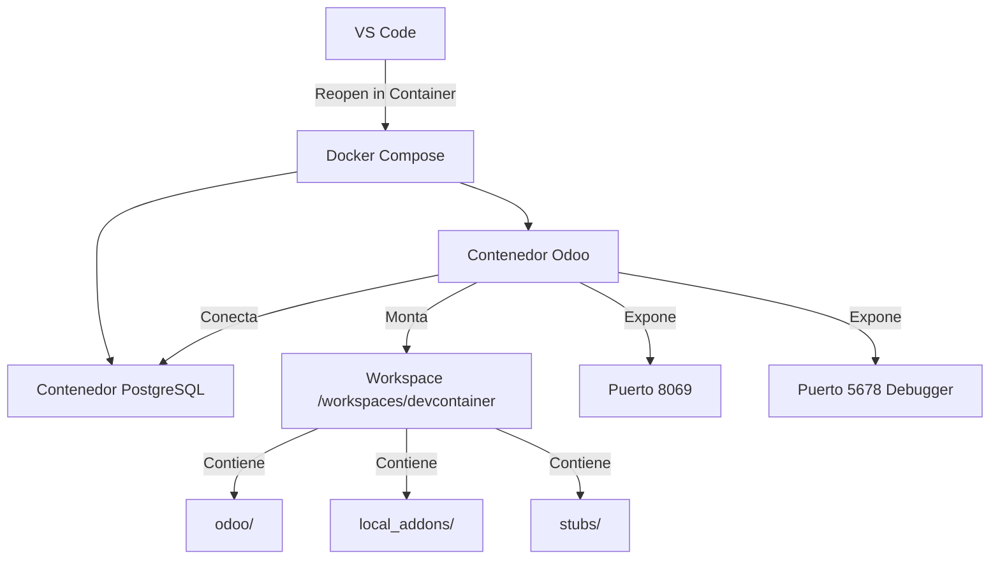

# Odoo 18 Development Environment

Entorno de desarrollo para Odoo 18 usando Docker y VS Code Dev Containers.

[](https://www.odoo.com/)
[](https://www.python.org/)
[](https://www.postgresql.org/)

**Características principales:**
- Dev Container configurado para VS Code
- Type checking con Pyright y odoo-stubs
- Debugging remoto con debugpy
- Linting y formateo con Ruff
- Hot reload automático

---

## 📋 Tabla de Contenidos

- [✨ Características Destacadas](#-características-destacadas)
- [📦 Requisitos Previos](#-requisitos-previos)
- [🚀 Inicio Rápido](#-inicio-rápido)
- [🏗️ Arquitectura del Proyecto](#%EF%B8%8F-arquitectura-del-proyecto)
- [⚙️ Configuración Detallada](#%EF%B8%8F-configuración-detallada)
- [💻 Desarrollo](#-desarrollo)
- [🔧 Herramientas Integradas](#-herramientas-integradas)
- [🐛 Troubleshooting](#-troubleshooting)
- [📚 Recursos](#-recursos)

---

## Características

**Entorno:**
- Dev Container para VS Code
- Odoo 18.0
- PostgreSQL 16
- Python 3.12
- Docker Compose
- Volúmenes persistentes

**Herramientas de desarrollo:**
- Pyright con odoo-stubs para type checking
- Ruff para linting y formateo
- Debugpy para debugging remoto
- Pre-commit hooks
- Hot reload (modo --dev=all)

## Estructura del Proyecto

```
📦 odoo-docker-compose/
├── 📁 odoo/               # ⚠️ Core de Odoo (clonar automáticamente)
├── 📁 stubs/              # Type stubs para autocompletado
├── 📁 local_addons/       # Tus módulos en desarrollo
├── 📁 oca/                # Módulos de la comunidad OCA
├── 📁 enterprise/         # Módulos enterprise (opcional)
├── 📁 extra_addons/       # Otras dependencias y plugins
├── 📁 conf/               # Configuración de Odoo
├── 📁 .devcontainer/      # Configuración del contenedor
│   ├── devcontainer.json  # VS Code Dev Container config
│   ├── docker-compose.yaml
│   ├── Dockerfile
│   ├── .env.example       # Variables de entorno (plantilla)
│   └── .env               # Variables de entorno (local)
├── 🔧 setup.sh            # Script de configuración inicial
├── 📄 pyproject.toml      # Configuración de Pyright y Ruff
└── 📄 README.md           # Este archivo
```

## Extensiones VS Code

| Extensión | Función |
|-----------|---------|
| **Odoo File** | Navegación de archivos Odoo |
| **OWL Vision** | Soporte para componentes OWL |
| **Odoo Extension** | Snippets y utilidades |
| **SQL Tools** | Cliente PostgreSQL |
| **Debugpy** | Debugging Python |
| **Pyright** | Type checking |
| **Ruff** | Linting y formateo |

---

## 📦 Requisitos Previos

### Software Requerido

| Software | Versión Mínima | Notas |
|----------|---------------|-------|
| **Docker** | 20.10+ | [Instalar Docker](https://docs.docker.com/get-docker/) |
| **Docker Compose** | 2.0+ | Incluido con Docker Desktop |
| **VS Code** | 1.80+ | [Descargar VS Code](https://code.visualstudio.com/) |
| **Dev Containers Extension** | - | Instalar desde VS Code Marketplace |
| **Git** | 2.30+ | Para clonar repositorios y submodules |

### Recursos del Sistema

| Recurso | Mínimo | Recomendado |
|---------|--------|-------------|
| **RAM** | 8 GB | 16 GB |
| **CPU** | 4 cores | 6+ cores |
| **Disco** | 20 GB libres | 50 GB+ libres |
| **SO** | Linux, macOS, Windows 10+ | - |

---

## 🚀 Inicio Rápido

### 📥 Paso 1: Clonar el Repositorio

```bash
# Clona este repositorio
git clone <URL-DE-TU-REPOSITORIO> odoo-dev
cd odoo-dev

# Inicializa los submódulos (odoo-stubs)
git submodule update --init --recursive
```

### ⚙️ Paso 2: Configurar Variables de Entorno

```bash
# Copia el archivo de ejemplo
cp .devcontainer/.env.example .devcontainer/.env

# Edita según tus necesidades (opcional)
nano .devcontainer/.env
```

**Archivo `.devcontainer/.env`:**
```bash
POSTGRES_VERSION=16
ODOO_VERSION=18
ENTRYPOINT=/usr/bin/python3 -m debugpy --listen 0.0.0.0:5678 /usr/bin/odoo -c /etc/odoo/odoo.conf --dev=all
```

### 🔧 Paso 3: Ejecutar Script de Configuración

```bash
# Da permisos de ejecución
chmod +x setup.sh

# Ejecuta el script (clonará Odoo y creará estructura)
./setup.sh
```

**El script:**
- Crea estructura de directorios (`local_addons`, `oca`, `enterprise`, `extra_addons`)
- Clona Odoo 18.0 desde https://github.com/odoo/odoo
- Actualiza odoo-stubs 18.0 desde https://github.com/odoo-ide/odoo-stubs.git
- Configura permisos

### 🐳 Paso 4: Abrir en Dev Container

```bash
# Abre VS Code en el directorio
code .
```

1. VS Code detectará la configuración
2. Click en "Reopen in Container"
3. Espera la construcción del contenedor (~5-10 minutos primera vez)
4. Odoo se iniciará automáticamente

### 🌐 Paso 5: Acceder a Odoo

| Servicio | URL | Credenciales |
|----------|-----|--------------|
| **Odoo Web** | http://localhost:8069 | Usuario: `admin` / Password: `admin` |
| **PostgreSQL** | `localhost:5432` | Usuario: `odoo` / Password: `admin` |
| **Debugger** | `localhost:5678` | Automático en VS Code |

**Master Password:** `1234` (configurada en `conf/odoo.conf`)

---

## 🏗️ Arquitectura del Proyecto

### 🔄 Flujo de Trabajo del Dev Container



### 📂 Directorios Clave

| Directorio | Propósito | Observaciones |
|------------|-----------|---------------|
| **`odoo/`** | Core de Odoo 18 | Clonado por `setup.sh` |
| **`stubs/`** | Type hints | Git submodule odoo-stubs |
| **`local_addons/`** | Módulos personalizados | Desarrollo de addons |
| **`oca/`** | Módulos OCA | Comunidad OCA |
| **`enterprise/`** | Módulos enterprise | Requiere licencia |
| **`extra_addons/`** | Otros módulos | Dependencias externas |
| **`conf/`** | Configuración | odoo.conf |

### 🔗 Repositorios Requeridos

El proyecto depende de estos repositorios externos:

1. **Odoo Core** - https://github.com/odoo/odoo (branch 18.0)
   - Ubicación: `./odoo/`
   - Clonado automáticamente por `setup.sh`

2. **Odoo Stubs** - https://github.com/odoo-ide/odoo-stubs.git (branch 18.0)
   - Ubicación: `./stubs/`
   - Git submodule, actualizado por `setup.sh`

---

## ⚙️ Configuración Detallada

### 🌍 Variables de Entorno (`.devcontainer/.env`)

```bash
POSTGRES_VERSION=16
ODOO_VERSION=18

# Con debugging remoto
ENTRYPOINT=/usr/bin/python3 -m debugpy --listen 0.0.0.0:5678 /usr/bin/odoo -c /etc/odoo/odoo.conf --dev=all

# Sin debugging remoto
# ENTRYPOINT=odoo -c /etc/odoo/odoo.conf --dev=all
```

### 🔌 Puertos Expuestos

| Puerto | Servicio | Uso |
|--------|----------|-----|
| **8069** | Odoo HTTP | Interfaz web principal |
| **8072** | Odoo Longpolling | WebSockets para chat y notificaciones |
| **5678** | Debugpy | Debugging remoto Python |
| **5432** | PostgreSQL | Base de datos (acceso directo) |

### 📍 Rutas Importantes en el Contenedor

| Ruta | Descripción |
|------|-------------|
| `/workspaces/devcontainer` | Workspace principal (mapea a raíz del proyecto) |
| `/workspaces/devcontainer/odoo` | Core de Odoo |
| `/etc/odoo/odoo.conf` | Archivo de configuración de Odoo |
| `/var/lib/odoo` | Datos persistentes de Odoo (volumen Docker) |
| `/usr/lib/python3/dist-packages/odoo` | Instalación base de Odoo (imagen Docker) |

### Configuración de Odoo (`conf/odoo.conf`)

```ini
[options]
addons_path = 
    /workspaces/devcontainer/enterprise,
    /workspaces/devcontainer/extra_addons,
    /workspaces/devcontainer/local_addons,
    /workspaces/devcontainer/oca

admin_passwd = 1234
db_host = postgres
db_user = odoo
db_password = admin

workers = 0
max_cron_threads = 1

limit_memory_soft = 1610612736
limit_memory_hard = 2147483648

log_level = info
list_db = True
without_demo = True
```

---

## 💻 Desarrollo

### Crear un Módulo

```bash
# Dentro del contenedor (terminal de VS Code)
cd /workspaces/devcontainer/local_addons

# Crear estructura básica del módulo
mkdir -p mi_modulo/{models,views,security}
cd mi_modulo

# Crear __manifest__.py
cat > __manifest__.py << 'EOF'
{
    'name': 'Mi Módulo',
    'version': '18.0.1.0.0',
    'category': 'Custom',
    'summary': 'Descripción breve del módulo',
    'author': 'Tu Nombre',
    'depends': ['base'],
    'data': [
        'security/ir.model.access.csv',
        'views/views.xml',
    ],
    'installable': True,
    'application': False,
    'auto_install': False,
}
EOF

# Crear __init__.py
echo "from . import models" > __init__.py
```

### Type Checking con Pyright

```python
# local_addons/mi_modulo/models/partner.py
from odoo import models, fields, api
from typing import List, Dict, Optional

class ResPartner(models.Model):
    _inherit = 'res.partner'
    
    custom_field: str = fields.Char(string="Campo Custom")
    
    @api.model
    def mi_metodo(self, datos: List[Dict]) -> List['ResPartner']:
        partners = self.env['res.partner'].browse([1, 2, 3])
        return partners.filtered(lambda p: p.active)
```

**Comandos:**

```bash
# Type checking completo
pyright

# Type checking con warnings
pyright --warnings

# Type checking de un archivo específico
pyright local_addons/mi_modulo/models/partner.py
```

### Formateo y Linting con Ruff

```bash
# Formateo automático
ruff format .

# Linting y auto-fix
ruff check --fix .

# Solo verificar sin modificar
ruff check .

# Verificar un directorio específico
ruff check local_addons/mi_modulo/
```

### Debugging Remoto

1. Ve a **Run and Debug** (Ctrl+Shift+D)
2. Crea `.vscode/launch.json`:

```json
{
    "version": "0.2.0",
    "configurations": [
        {
            "name": "Python: Remote Attach",
            "type": "debugpy",
            "request": "attach",
            "connect": {
                "host": "localhost",
                "port": 5678
            },
            "pathMappings": [
                {
                    "localRoot": "${workspaceFolder}",
                    "remoteRoot": "/workspaces/devcontainer"
                }
            ]
        }
    ]
}
```

3. Coloca breakpoints en tu código
4. Ejecuta "Python: Remote Attach"
5. El breakpoint se activará al ejecutar el código en Odoo

### Agregar Módulos de OCA

```bash
# Dentro de la carpeta oca/
cd /workspaces/devcontainer/oca

# Clonar repositorio de OCA como submodule
git submodule add https://github.com/OCA/web.git web
git submodule add https://github.com/OCA/server-tools.git server-tools

# Actualizar submódulos
git submodule update --init --recursive
```


---

## 🔧 Herramientas Integradas

### Pre-commit Hooks

Configuración de pre-commit para calidad de código:

```bash
# Instalar hooks (dentro del contenedor)
pre-commit install

# Ejecutar manualmente en todos los archivos
pre-commit run --all-files

# Ejecutar solo en archivos staged
pre-commit run
```

**Configuración (`.pre-commit-config.yml`):**
- ✅ Ruff formatting
- ✅ Ruff linting
- ✅ Trailing whitespace
- ✅ End of file fixer

### SQL Tools (PostgreSQL)

Conexión directa a PostgreSQL:

**Configuración:**
- Host: `postgres`
- Port: `5432`
- Database: `postgres`
- Username: `odoo`
- Password: `admin`

### Odoo Shell

```bash
# Acceder a shell de Odoo
odoo shell -c /etc/odoo/odoo.conf -d nombre_db

# Ejemplo de uso
>>> self.env['res.partner'].search([])
>>> self.env.user
```

---

## 🐛 Troubleshooting

### "Permission denied" en archivos

**Solución:**
```bash
# Fuera del contenedor
sudo chown -R $USER:$USER .
chmod -R 775 local_addons oca enterprise extra_addons odoo
```

### Odoo no arranca o se reinicia

**Diagnóstico:**
```bash
# Ver logs del contenedor
docker logs -f odoo

# Verificar recursos
docker stats odoo
```

**Soluciones:**
- Reducir `workers` en `conf/odoo.conf` (o dejarlo en 0)
- Aumentar límites de memoria en Docker Desktop
- Verificar que PostgreSQL esté corriendo: `docker ps | grep postgres`

### ModuleNotFoundError: No module named 'odoo'

**Solución:**
```bash
# Ejecuta el setup para clonar Odoo
./setup.sh

# Verifica que existe el directorio
ls -la odoo/

# Reconstruye el contenedor
# VS Code: Ctrl+Shift+P → "Dev Containers: Rebuild Container"
```

### Type checking no funciona

**Solución:**
```bash
# Actualiza los stubs
cd stubs/
git pull origin 18.0  # O la versión que uses

# Verifica configuración de Pyright
cat pyproject.toml

# Reinicia el language server en VS Code
# Ctrl+Shift+P → "Pyright: Restart Server"
```

### Puerto 8069 ya en uso

**Solución:**
```bash
# Encuentra el proceso usando el puerto
sudo lsof -i :8069

# Mata el proceso
sudo kill -9 <PID>

# O cambia el puerto en docker-compose.yaml
# Edita .devcontainer/docker-compose.yaml
# ports:
#   - "8070:8069"  # Usar 8070 en vez de 8069
```

### Base de datos no se crea

**Solución:**
```bash
# Verifica que PostgreSQL está corriendo
docker ps | grep postgres

# Conéctate a PostgreSQL y verifica
docker exec -it postgres psql -U odoo -d postgres

# Dentro de PostgreSQL
\l  # Lista bases de datos
\q  # Salir

# Verifica master password en conf/odoo.conf
grep admin_passwd conf/odoo.conf
```

### Hot reload no funciona

**Solución:**
```bash
# Verifica que estás en modo desarrollo
# conf/odoo.conf debe tener workers = 0
# o ENTRYPOINT debe incluir --dev=all

# Reinicia el servicio Odoo manualmente
docker restart odoo

# Desde Odoo web: actualiza el módulo
# Apps → Busca tu módulo → Actualizar
```

---

## 📚 Recursos

### 📖 Documentación Oficial

- [Odoo Developer Documentation](https://www.odoo.com/documentation/18.0/developer.html)
- [Odoo ORM API](https://www.odoo.com/documentation/18.0/developer/reference/backend/orm.html)
- [Docker Compose Reference](https://docs.docker.com/compose/compose-file/)
- [VS Code Dev Containers](https://code.visualstudio.com/docs/devcontainers/containers)
- [Pyright Documentation](https://microsoft.github.io/pyright/)
- [Ruff Linter](https://docs.astral.sh/ruff/)

### 🌐 Comunidad y Soporte

- [Odoo Community Forum](https://www.odoo.com/forum/help-1)
- [OCA GitHub Organization](https://github.com/OCA)
- [Stack Overflow - Odoo Tag](https://stackoverflow.com/questions/tagged/odoo)
- [Odoo Discord Community](https://discord.gg/odoo)

### 🎓 Tutoriales y Guías

- [Odoo Development Cookbook](https://www.packtpub.com/product/odoo-development-cookbook-fourth-edition/)
- [OCA Development Guidelines](https://github.com/OCA/odoo-community.org/blob/master/website/Contribution/CONTRIBUTING.rst)
- [Best Practices for Odoo Development](https://www.odoo.com/documentation/18.0/developer/howtos.html)


## Contribución

1. Fork del repositorio
2. Feature branch: `git checkout -b feature/nueva-funcionalidad`
3. Commits: `[FEAT]:`, `[FIX]:`, `[DOCS]:`, `[REF]:`
4. Push y Pull Request

**Standards:**
- PEP 8 (verificado por Ruff)
- Type hints
- Docstrings
- Tests


## FAQ

### ¿Puedo usar carpetas fuera del workspace?

Sí, montando volúmenes en `docker-compose.yaml`, pero no es recomendado para Odoo core por problemas de permisos y reproducibilidad. Usa `setup.sh` para clonar Odoo dentro del proyecto.

### ¿Cómo agrego módulos Enterprise?

```bash
cp -r /ruta/a/enterprise/* /workspaces/devcontainer/enterprise/
docker restart odoo
```

### Backup de base de datos

```bash
# Backup
docker exec -t postgres pg_dump -U odoo nombre_db > backup.sql

# Restaurar
docker exec -i postgres psql -U odoo -d nombre_db < backup.sql
```